# LPSB Computer Science Hub
The Langley Park School for Boys Computer Science Hub (LPSB Computer Science Hub) is a site that hopes to help students to revise for their computer science GCSE. The LPSB Computer science Hub will be useful for students to see exactly what content they will need to know, give them guidance to help them understand the content and provide the students with questions to test their understanding of the content. 

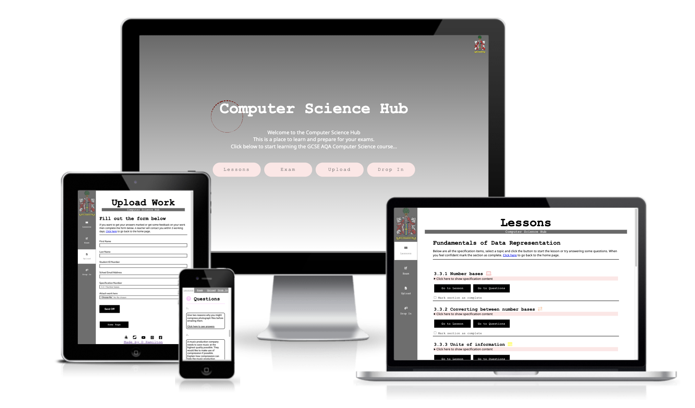

## User Stories 
|Story No.|Story|
| ------------- | ------------- |
|1| As a student,   I want to be able to answer past exam questions   so that I can get practice answering the correct style of questions that are in the exam in September.   I know I am done when students can download the exam paper PDF documents |
|2|As a student,   I want to be able to get help from a teacher if I am finding a topic difficult   so that I can get help and alert the teach that I want to go over the topic again.  I know I am done when students can contact teachers telling them when they would like to get help.|
|3|As a student,   I want to be able to get feedback from a teacher   so that I know if I am getting the answers correct and work out the answers correctly.    I know I am done when students can share their work with teachers.|
|4|As a student,  I want to be able to view notes and lessons   so that I can revise and learn the topic.     I know I am done when students can view the teachers lessons online.|
|5|As a student,  I want to be able to answer questions    so that I can test my knowledge of the topic.    I know I am done when students can view the questions that are linked to the lesson to help understand the topic. |
|6|As a student,  I want to be able to self mark my work after lessons.  so that I can move onto the next topic.     I know I am done when students can view the answers to the questions that are linked to the lesson to help understand the topic. |
|7|As a student,   I want to be able to watch videos that are linked to the lesson    so that I can get a more visual and audial way of learning.    I know I am done when the topic videos are watchable from the website. |
|8|As a student,  I want to be able to easy navigate the pages    so that I can get to the learning content quickly and efficiently to maximise learning time.     I know I am done when all pages have clear links and sign postage.|
|9|As a student,   I want to be able to see what I need to know for my exam    so that I learn the correct content for my GCSE    I know I am done when the AQA GCSE Specification can be viewed on the site. |
|10|As a student,   I want to be able to save what topics I have completed    so that I can keep track on where I am up to and not waste time doing a topic twice.    I know I am done when the students can return to the site and have their progress shown.|
|12|As a teacher   want to be able to receive work from LPSB. Students   so that I don’t get work from people outside of the school    I know I am done when the students can only submit work. |
|13|As a teacher  I want to be able to organise sessions  with students that need help, from LPSB.   so that I don’t get requests from people outside of the school    I know I am done when the students can only book if they are a student. |
|14|As a user,   I want to be able to see what exam board the school is doing  so that I can get more information about the computer science department     I know I am done when the AQA subject title is shown on the site.|
|15|As a user,   I want to be able to go to the school website  so that I can get to more information about the school     I know I am done when I have clear links to the school website.|

## Features 
- __Index__
    - The home page shows the name of the site and has a constrasting color with the background.
    - The instructions are clear and explains what teh site is for.
    - The four buttons are large and give a clear descrption of what it does when hovered. 

    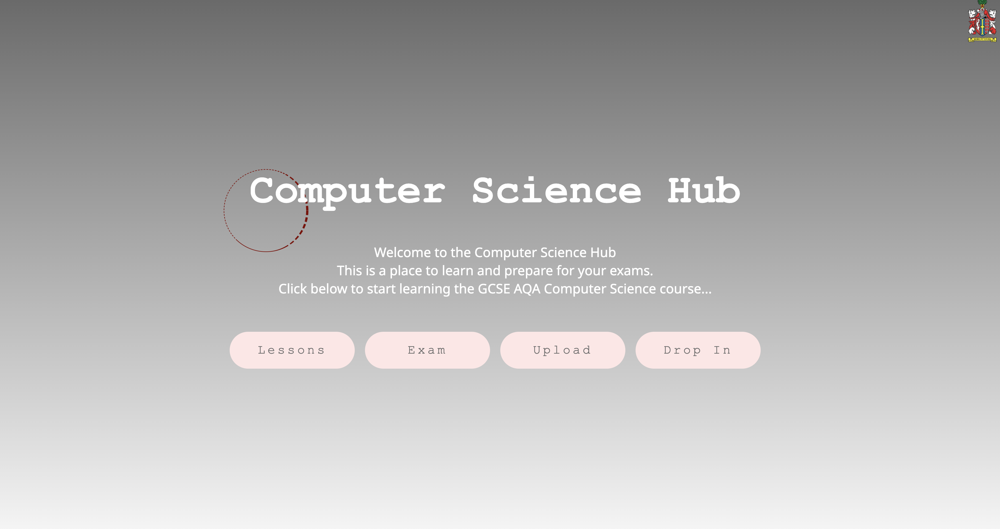

- __Navigation__
    - The Navigation bar is fixed to the left of the screen, with links to the school webiste and four main pages.
    - When on a smaller device the naviagtion bar is fixed at the top with just the four main buttons showing.
    - The font is a easy to read for students and is perfect for e-learning. 
    - The color is consistant with the index page and inverts when hovered. 
    
    
    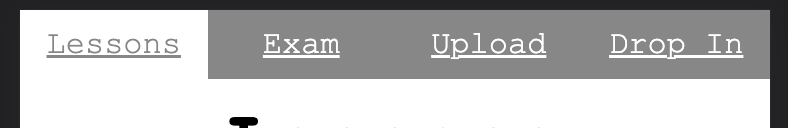

- __Lessons__
    - The page has a clear breakdown of the specification headers. Each section has its own color to help users know what section they are currently learning.
    - Students can pres the link to see the speciufication as it is written in the AQA exam board page. 
    - Buttons in each section to go to the lessons or go to the questions for students to answer. 
    - The button for studnets to makr sections that they have comopletetd. It will store the state in local storage so when students end the session the data will still be there for the next session. 

    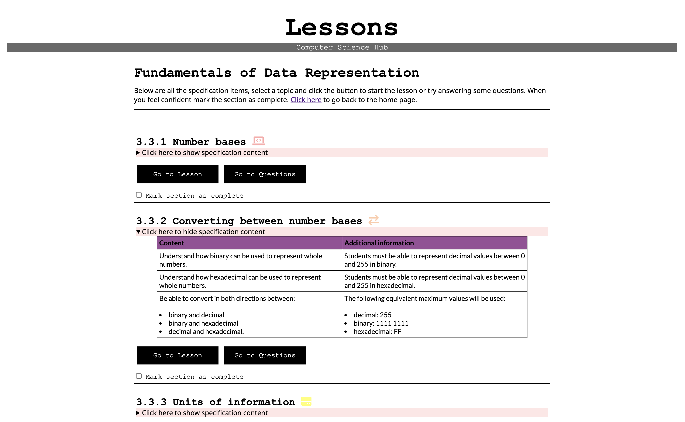

- __Questions__
    - The questions page has questions form the teacher lessons to check students understanding. 
    - The button that says 'click here to see answers' shows the answers below for students to look at. 

    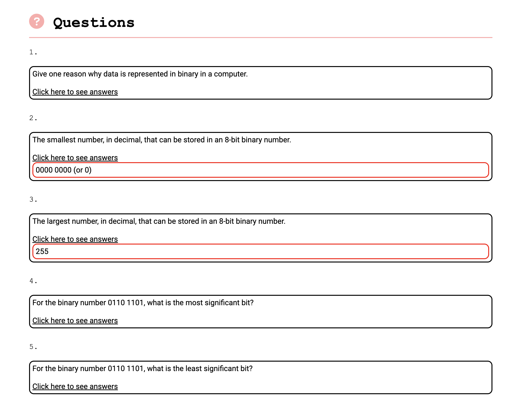

- __Specification Page__
    - The content from the teacher lessons are shown ont he page for students to read. 
    - The page also has videos that link to the youtube revison channel used in lessons in the school. 
    - The font used is Roboto which is perfect for children when e-learning. 

    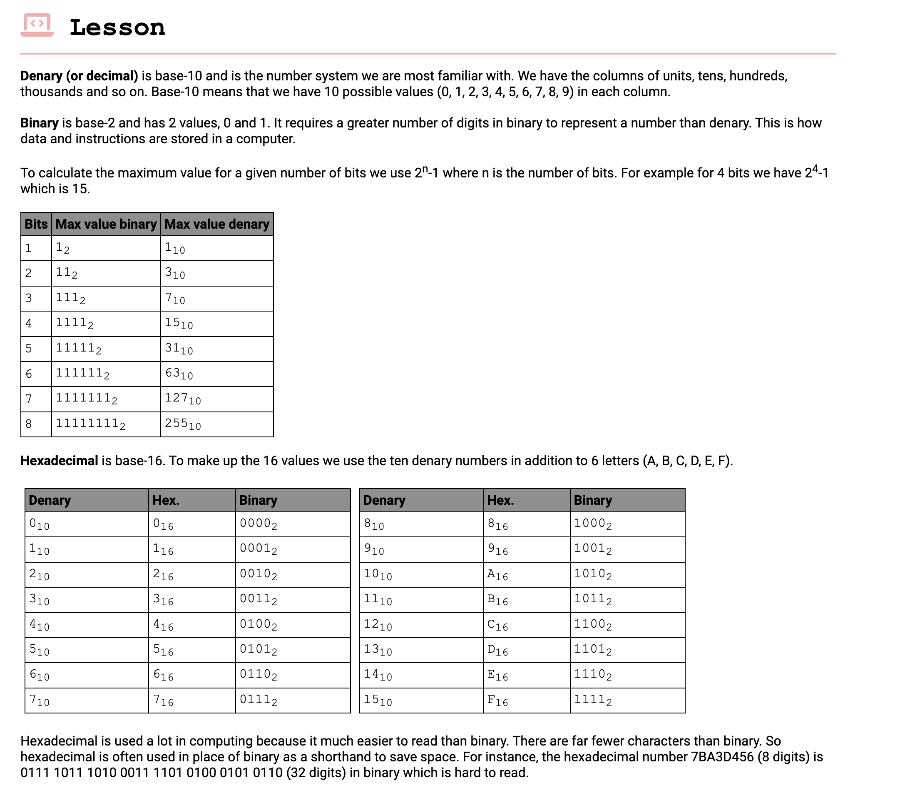

- __Exams__
    - Button for each specification item which downloads the pdf exam questions. 
    - The max sore for students is shown so students know roughly how many questions are in the pdf.
    - The colors are consistnt in the site that link each specification number to a certain color. 

    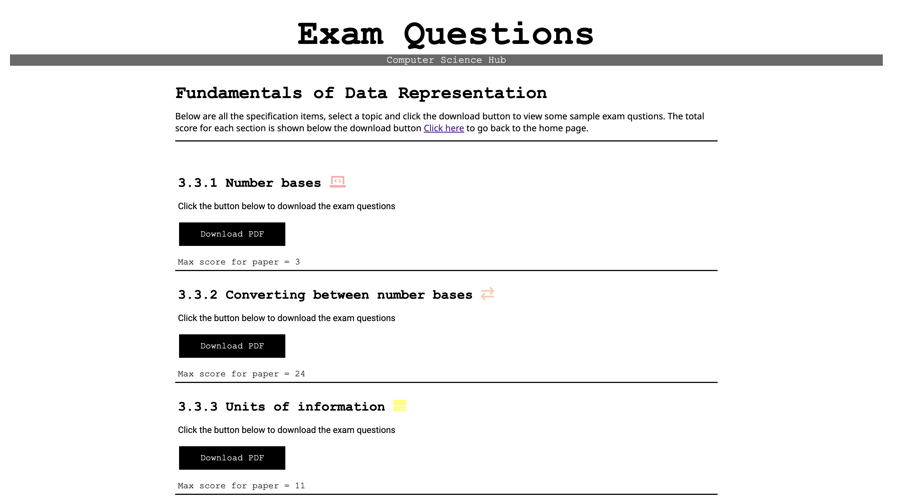

- __Drop in__
    - The form collects data about the student.
    - The stduents must enter a valid students emial address that ends with "lpsb.org.uk". this prevents students that are not in the school to book lesosns with teachers.
    - Students can upload files to the form so that teacher can see it. 

    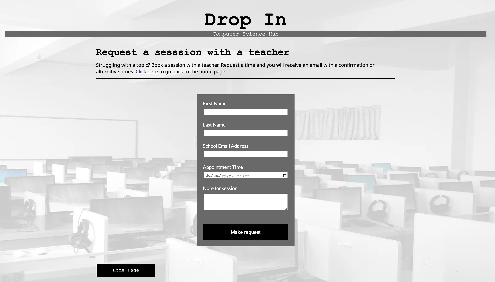

- __Upload__
    - The stduents must enter a valid students emial address that ends with "lpsb.org.uk". this prevents students that are not in the school to upload work to teachers.
    - There is a data time picker so that stduents can book a time. 

    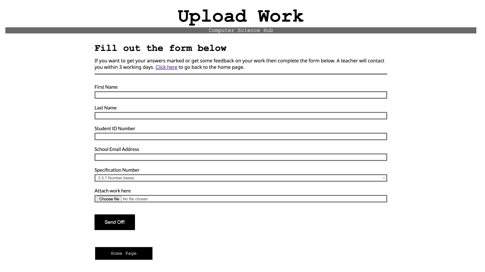
        
- __Form Completeion__
    - Shows the data that the fiorm has sent off.
    - After 10 seconds the page will go back to the home page.
    - There is a countdown whcih shows how long is left in the countdown. 

    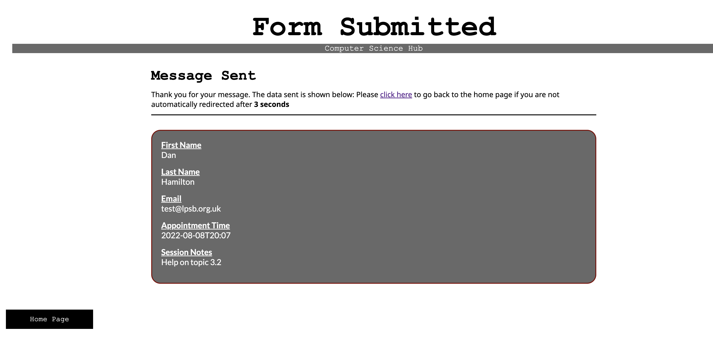

- __Footer__
    - Has links to the exam board, school and social media pages of the school. 
    - There is also an external link to my Github page. 

    

## Testing 

### User stories Testing
1. Test Past - Students can press the download buytton on the exams opage to download exam questions.

2. Test Past - Students are able to use the form on the drop in page to book a session with a teacher.

3. Test Past - Students are able to use the form on the upload page to upload files to a teacher.

4. Test Past - The lessons formt he teachers have been placed onto specifiaction pages for students to read and interact with. 

5. 

6. 

7. 

8. 

9. 

10. 

11. 

12. 

13. 

14. 

15. 

### Validator Testing

- HTML
    - Index: No errors were returned when passing through the official W3C validator  https://validator.w3.org/nu/?doc=https%3A%2F%2Fdlhamilton.github.io%2FLPSB-Learn-GCSE-CS%2Findex.html

   - Lessons: No errors were returned when passing through the official W3C validator  https://validator.w3.org/nu/?doc=https%3A%2F%2Fdlhamilton.github.io%2FLPSB-Learn-GCSE-CS%2Flessons.html

   - s_3_1: No errors were returned when passing through the official W3C validator https://validator.w3.org/nu/?doc=https%3A%2F%2Fdlhamilton.github.io%2FLPSB-Learn-GCSE-CS%2Fs_3_1.html

   - s_3_2: No errors were returned when passing through the official W3C validator https://validator.w3.org/nu/?doc=https%3A%2F%2Fdlhamilton.github.io%2FLPSB-Learn-GCSE-CS%2Fs_3_2.html

   - s_3_3: No errors were returned when passing through the official W3C validator https://validator.w3.org/nu/?doc=https%3A%2F%2Fdlhamilton.github.io%2FLPSB-Learn-GCSE-CS%2Fs_3_3.html

   - s_3_4: No errors were returned when passing through the official W3C validator https://validator.w3.org/nu/?doc=https%3A%2F%2Fdlhamilton.github.io%2FLPSB-Learn-GCSE-CS%2Fs_3_4.html

   - s_3_5: No errors were returned when passing through the official W3C validator https://validator.w3.org/nu/?doc=https%3A%2F%2Fdlhamilton.github.io%2FLPSB-Learn-GCSE-CS%2Fs_3_5.html

  - s_3_6: No errors were returned when passing through the official W3C validator  https://validator.w3.org/nu/?doc=https%3A%2F%2Fdlhamilton.github.io%2FLPSB-Learn-GCSE-CS%2Fs_3_6.html

  - s_3_7: No errors were returned when passing through the official W3C validator  https://validator.w3.org/nu/?doc=https%3A%2F%2Fdlhamilton.github.io%2FLPSB-Learn-GCSE-CS%2Fs_3_7.html

   - s_3_8: No errors were returned when passing through the official W3C validator https://validator.w3.org/nu/?doc=https%3A%2F%2Fdlhamilton.github.io%2FLPSB-Learn-GCSE-CS%2Fs_3_8.html

   - Exams: No errors were returned when passing through the official W3C validator https://validator.w3.org/nu/?doc=https%3A%2F%2Fdlhamilton.github.io%2FLPSB-Learn-GCSE-CS%2Fexams.html

   - Upload: No errors were returned when passing through the official W3C validator https://validator.w3.org/nu/?doc=https%3A%2F%2Fdlhamilton.github.io%2FLPSB-Learn-GCSE-CS%2Fupload.html

   - Drop-In: No errors were returned when passing through the official W3C validator https://validator.w3.org/nu/?doc=https%3A%2F%2Fdlhamilton.github.io%2FLPSB-Learn-GCSE-CS%2Fdrop_in.html

   - Form Confirmation: No errors were returned when passing through the official W3C validator https://validator.w3.org/nu/?doc=https%3A%2F%2Fdlhamilton.github.io%2FLPSB-Learn-GCSE-CS%2Fform_confirmation.html

- CSS
    - No errors were found when passing through the official Jigsaw validator
    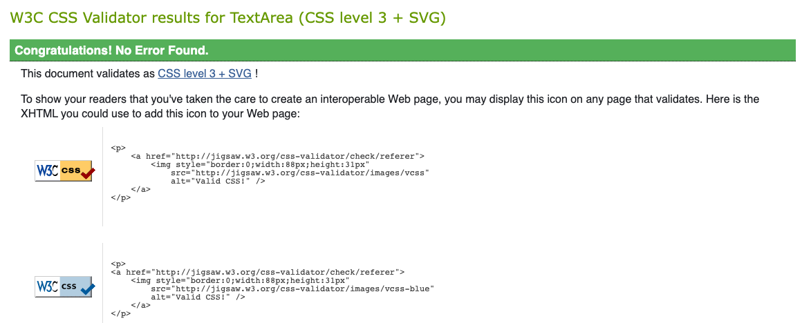

### Functionaility Testing
- I have tested that this page works in diffeent web browsers.
- I have tested that the project is responsive and works with different device sizes. It looks good and functions as normal. 
- I have tested all links, intrnal and external. They go to the correct destination and open in the correct way. 
- I have tested that all text and fonts are readable and easy to understand.
- I have tested that the correct data is passed when the forms are submitted. 
### Bugs

The background image on the drop in page does n show up on mobile devices. I will bne making corrections in the comming weeks. 

## Deployment

### Clone

### Local Deployment

### Remote Deployment 

## Credits

### Content

### Media

### Extra help
- Blog looking into the best learning font for online learing - https://www.ttro.com/blog/design/five-free-fonts-that-will-improve-your-e%E2%80%91learning/

