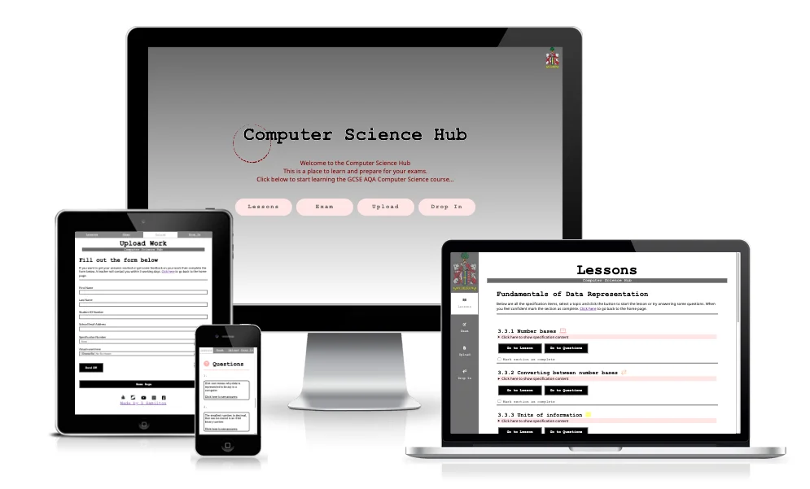

# LPSB Computer Science Hub
The Langley Park School for Boys Computer Science Hub (LPSB Computer Science Hub) is a site that hopes to help students to revise for their computer science GCSE. The LPSB Computer science Hub will be useful for students to see exactly what content they will need to know, give them guidance to help them understand the content and provide the students with questions to test their understanding of the content. 



***

## User Stories 
|Story No.|Story|
| ------------- | ------------- |
|1| As a student, <br> I want to be able to answer past exam questions <br> so that I can get practice answering the correct style of questions that are in the exam in September. <br><br>I know I am done when students can download the exam paper PDF documents |
|2|As a student, <br> I want to be able to get help from a teacher if I am finding a topic difficult <br> so that I can get help and alert the teach that I want to go over the topic again.<br><br>I know I am done when students can contact teachers telling them when they would like to get help.|
|3|As a student, <br> I want to be able to get feedback from a teacher <br> so that I know if I am getting the answers correct and work out the answers correctly. <br><br> I know I am done when students can share their work with teachers.|
|4|As a student,<br> I want to be able to view notes and lessons <br> so that I can revise and learn the topic. <br> <br> I know I am done when students can view the teachers lessons online.|
|5|As a student, <br>I want to be able to answer questions  <br> so that I can test my knowledge of the topic.<br> <br> I know I am done when students can view the questions that are linked to the lesson to help understand the topic. |
|6|As a student, <br>I want to be able to self mark my work after lessons.<br> so that I can move onto the next topic. <br> <br> I know I am done when students can view the answers to the questions that are linked to the lesson to help understand the topic. |
|7|As a student, <br> I want to be able to watch videos that are linked to the lesson  <br> so that I can get a more visual and audial way of learning.<br> <br> I know I am done when the topic videos are watchable from the website. |
|8|As a student, <br>I want to be able to easy navigate the pages  <br> so that I can get to the learning content quickly and efficiently to maximise learning time. <br> <br> I know I am done when all pages have clear links and sign postage.|
|9|As a student, <br> I want to be able to see what I need to know for my exam  <br> so that I learn the correct content for my GCSE<br> <br> I know I am done when the AQA GCSE Specification can be viewed on the site. |
|10|As a student, <br> I want to be able to save what topics I have completed  <br> so that I can keep track on where I am up to and not waste time doing a topic twice.<br> <br> I know I am done when the students can return to the site and have their progress shown.|
|11|As a teacher<br>  want to be able to receive work from LPSB. Students <br> so that I don’t get work from people outside of the school<br> <br> I know I am done when the students can only submit work. |
|12|As a teacher<br> I want to be able to organise sessions  with students that need help, from LPSB. <br> so that I don’t get requests from people outside of the school<br> <br> I know I am done when the students can only book if they are a student. |
|13|As a teacher<br> I want to be able to have the students ID number when they send work <br> so that I can easily identify what student has sent work to me<br> <br> I know I am done when the students work has a ID number with it when work is sent.|
|14|As a user, <br> I want to be able to see what exam board the school is doing<br> so that I can get more information about the computer science department and know what exam board they follow.<br> <br> I know I am done when the AQA subject title is shown on the site.|
|15|As a user, <br> I want to be able to go to the school website<br> so that I can get to more information about the school <br> <br> I know I am done when I have clear links to the school website.|

***

## Features 
- __Index__
    - The home page shows the name of the site and has a constrasting color with the background.
    - The instructions are clear and explains what the site is for.
    
    
     - The four buttons are large and give a clear descrption of what it does when hovered. The colors change to make it clear to the user what they are currently selecting.
    
    

- __Navigation__
    - The Navigation bar is fixed to the left of the screen, with links to the school webiste and four main pages.
    - When on a smaller device the naviagtion bar is fixed at the top with just the four main buttons showing.
    - The font is a easy to read for students and is perfect for e-learning. 
    - The color is consistant with the index page and inverts when hovered. 
    
    
    

- __Lessons__
    - The page has a clear breakdown of the specification headers. Each section has its own color to help users know what section they are currently learning.
    
    
    - The button for studnets to make sections that they have comopletetd. It will store the state in local storage so when students end the session the data will still be there for the next session. 
    
    
    - Buttons in each section to go to the lessons or go to the questions for students to answer. The color changes to match the color of the specification content
    
    
     - Students can press the link to see the specification as it is written in the AQA exam board page. 
    
    

- __Questions__
    - The questions page has questions form the teacher lessons to check students understanding. 
    - The button that says 'click here to see answers' shows the answers in red below for students to look at. They can toggle the answer display.  
    
    

- __Specification Page__
    - The content from the teacher lessons are shown on the page for students to read. 
    - The font used is Roboto which is perfect for children when e-learning. 
    
    
    - The page also has videos that link to the youtube revison channel used in lessons in the school. 
    
    

- __Exams__
    - Button for each specification item which downloads the pdf exam questions. 
    - The max sore for students is shown so students know roughly how many questions are in the pdf.
    - The colors are consistnt in the site that link each specification number to a certain color. 
    
    

- __Drop in__
    - The form collects data about the student.
    - The stduents must enter a valid students emial address that ends with "lpsb.org.uk". this prevents students that are not in the school to book lesosns with teachers.
    - Students can upload files to the form so that teacher can see it. 
    
    

- __Upload__
    - The stduents must enter a valid students emial address that ends with "lpsb.org.uk". this prevents students that are not in the school to upload work to teachers.
    - There is a data time picker so that stduents can book a time.
    
    
        
- __Form Completeion__
    - Shows the data that the fiorm has sent off.
    - After 10 seconds the page will go back to the home page.
    - There is a countdown whcih shows how long is left in the countdown.
    
    

- __Footer__
    - Has links to the exam board, school website and social media pages of the school. 
    - There is also an external link to my Github page.
    
    

***

## Testing 

### Validator Testing
- HTML
    - Index: No errors were returned when passing through the official W3C validator<br> https://validator.w3.org/nu/?doc=https%3A%2F%2Fdlhamilton.github.io%2FLPSB-Learn-GCSE-CS%2Findex.html

   - Lessons: No errors were returned when passing through the official W3C validator<br> https://validator.w3.org/nu/?doc=https%3A%2F%2Fdlhamilton.github.io%2FLPSB-Learn-GCSE-CS%2Flessons.html

   - s_3_1: No errors were returned when passing through the official W3C validator<br>https://validator.w3.org/nu/?doc=https%3A%2F%2Fdlhamilton.github.io%2FLPSB-Learn-GCSE-CS%2Fs_3_1.html

   - s_3_2: No errors were returned when passing through the official W3C validator<br>https://validator.w3.org/nu/?doc=https%3A%2F%2Fdlhamilton.github.io%2FLPSB-Learn-GCSE-CS%2Fs_3_2.html

   - s_3_3: No errors were returned when passing through the official W3C validator<br>https://validator.w3.org/nu/?doc=https%3A%2F%2Fdlhamilton.github.io%2FLPSB-Learn-GCSE-CS%2Fs_3_3.html

   - s_3_4: No errors were returned when passing through the official W3C validator<br>https://validator.w3.org/nu/?doc=https%3A%2F%2Fdlhamilton.github.io%2FLPSB-Learn-GCSE-CS%2Fs_3_4.html

   - s_3_5: No errors were returned when passing through the official W3C validator<br>https://validator.w3.org/nu/?doc=https%3A%2F%2Fdlhamilton.github.io%2FLPSB-Learn-GCSE-CS%2Fs_3_5.html

  - s_3_6: No errors were returned when passing through the official W3C validator<br> https://validator.w3.org/nu/?doc=https%3A%2F%2Fdlhamilton.github.io%2FLPSB-Learn-GCSE-CS%2Fs_3_6.html

  - s_3_7: No errors were returned when passing through the official W3C validator<br> https://validator.w3.org/nu/?doc=https%3A%2F%2Fdlhamilton.github.io%2FLPSB-Learn-GCSE-CS%2Fs_3_7.html

   - s_3_8: No errors were returned when passing through the official W3C validator<br>https://validator.w3.org/nu/?doc=https%3A%2F%2Fdlhamilton.github.io%2FLPSB-Learn-GCSE-CS%2Fs_3_8.html

   - Exams: No errors were returned when passing through the official W3C validator<br>https://validator.w3.org/nu/?doc=https%3A%2F%2Fdlhamilton.github.io%2FLPSB-Learn-GCSE-CS%2Fexams.html

   - Upload: No errors were returned when passing through the official W3C validator<br>https://validator.w3.org/nu/?doc=https%3A%2F%2Fdlhamilton.github.io%2FLPSB-Learn-GCSE-CS%2Fupload.html

   - Drop-In: No errors were returned when passing through the official W3C validator<br>https://validator.w3.org/nu/?doc=https%3A%2F%2Fdlhamilton.github.io%2FLPSB-Learn-GCSE-CS%2Fdrop_in.html

   - Form Confirmation: No errors were returned when passing through the official W3C validator<br>https://validator.w3.org/nu/?doc=https%3A%2F%2Fdlhamilton.github.io%2FLPSB-Learn-GCSE-CS%2Fform_confirmation.html

- CSS
    - No errors were found when passing through the official Jigsaw validator
    https://jigsaw.w3.org/css-validator/validator?uri=https%3A%2F%2Fdlhamilton.github.io%2FLPSB-Learn-GCSE-CS%2Fassets%2Fcss%2Fstyle.css&profile=css3svg&usermedium=all&warning=1&vextwarning=&lang=en

### User stories Testing
|Story No.|Result|Story/ Evidence|
| ------------- | ------------- | ------------- |
|1|<font color="green">Test Pass</font>|As a student, <br> I want to be able to answer past exam questions <br> so that I can get practice answering the correct style of questions that are in the exam in September. <br><br>I know I am done when students can download the exam paper PDF documents<br><br>Evidence:<br>Students can press the download button on the exams page to download exam questions.<br> |
|2|*<font color="yellow">Test Pass, more required</font>* |As a student, <br> I want to be able to get help from a teacher if I am finding a topic difficult <br> so that I can get help and alert the teach that I want to go over the topic again.<br><br>I know I am done when students can contact teachers telling them when they would like to get help.<br><br>Evidence:<br>Students are able to use the form on the drop in page to book a session with a teacher. (The backend systems have not been put in place so wll only go to a dummy confirmation page.)<br>|
|3|*<font color="yellow">Test Pass, more required</font>* |As a student, <br> I want to be able to get feedback from a teacher <br> so that I know if I am getting the answers correct and work out the answers correctly. <br><br> I know I am done when students can share their work with teachers.<br><br>Evidence:<br>Students are able to use the form on the upload page to upload files to a teacher.(The backend systems have not been put in place so wll only go to a dummy confirmation page.)<br>||
|4|<font color="green">Test Pass</font> |As a student,<br> I want to be able to view notes and lessons <br> so that I can revise and learn the topic. <br> <br> I know I am done when students can view the teachers lessons online.<br><br>Evidence:<br>The lessons from the teachers have been placed onto specifiaction pages for students to read and interact with.<br>|
|5|<font color="green">Test Pass</font> |As a student, <br>I want to be able to answer questions  <br> so that I can test my knowledge of the topic.<br> <br> I know I am done when students can view the questions that are linked to the lesson to help understand the topic. <br><br>Evidence:<br>The questions from the teachers lessons have been put onto all the content pages for students to answer.<br> |
|6|<font color="green">Test Pass</font> |As a student, <br>I want to be able to self mark my work after lessons.<br> so that I can move onto the next topic. <br> <br> I know I am done when students can view the answers to the questions that are linked to the lesson to help understand the topic.<br><br>Evidence:<br>The questions have been given a button which displays the answer when clicked. This allows stduents to answer the questions, then check the answer.<br> |
|7|<font color="green">Test Pass</font> |As a student, <br> I want to be able to watch videos that are linked to the lesson  <br> so that I can get a more visual and audial way of learning.<br> <br> I know I am done when the topic videos are watchable from the website. <br><br>Evidence:<br>The videos from the Craig and Dave youube channel have been embbeded onto the conen pages.<br>|
|8|<font color="green">Test Pass</font> |As a student, <br>I want to be able to easy navigate the pages  <br> so that I can get to the learning content quickly and efficiently to maximise learning time. <br> <br> I know I am done when all pages have clear links and sign postage.<br><br>Evidence:<br>Every page has a signpost explaining what the page contains and all links to main pages are visible from all pages.<br>|
|9|<font color="green">Test Pass</font> |As a student, <br> I want to be able to see what I need to know for my exam  <br> so that I learn the correct content for my GCSE<br> <br> I know I am done when the AQA GCSE Specification can be viewed on the site. <br><br>Evidence:<br>The lesson pages have been given a button which displays the specification table from the AQA Exam Board when clicked.<br>|
|10|<font color="green">Test Pass</font> |As a student, <br> I want to be able to save what topics I have completed  <br> so that I can keep track on where I am up to and not waste time doing a topic twice.<br> <br> I know I am done when the students can return to the site and have their progress shown.<br><br>Evidence:<br>The use of java script allows local storage to store if the check box for completion has been ticked or not.<br>|
|11|<font color="green">Test Pass</font> |As a teacher<br>  want to be able to receive work from LPSB. Students <br> so that I don’t get work from people outside of the school<br> <br> I know I am done when the students can only submit work. <br><br>Evidence:<br>The form has validation which only allows a valid LPSB email to complete the form. The email must end in lpsb.org.uk<br>|
|12|<font color="green">Test Pass</font> |As a teacher<br> I want to be able to organise sessions  with students that need help, from LPSB. <br> so that I don’t get requests from people outside of the school<br> <br> I know I am done when the students can only book if they are a student.<br><br>Evidence:<br>The form has validation which only allows a valid LPSB email to complete the form. The email must end in lpsb.org.uk<br>|
|13|<font color="green">Test Pass</font> |As a teacher<br> I want to be able to have the students ID number when they send work <br> so that I can easily identify what student has sent work to me<br> <br> I know I am done when the students work has a ID number with it when work is sent.<br>|
|14|<font color="green">Test Pass</font> |As a user, <br> I want to be able to see what exam board the school is doing<br> so that I can get more information about the computer science department and know what exam board they follow.<br> <br> I know I am done when the AQA subject title is shown on the site.<br><br>Evidence:<br>The index of the page has the exam board clearly displayed so that users that dont go to the school or people who want to do computer science know what exam board the school do.<br>|
|15|<font color="green">Test Pass</font>|As a user, <br> I want to be able to go to the school website<br> so that I can get to more information about the school <br> <br> I know I am done when I have clear links to the school website.<br><br>Evidence:<br>The school badge has been made into a link so people can click the logo to go to the school website.<br>  . |

### Accessibility Testing

To check the colors and fonts, I used Lighthouse in the Google devtools. The results are shown below:

| Index  |
| ------- |
|  |

| Lessons |
| ------- |
|  |

| Exams | 
| ------- |
|  |

| Upload |
| ------- |
|  |

| Drop-in |
| ------- |
|  |

| s_3_1, s_3_2, s_3_3, s_3_4, s_3_5, s_3_6, s_3_7, s_3_8 |
| ------- |
|  |

### Manual Testing
- I have tested that this page works in diffeent web browsers.
    - google, d and m
    - safari, d , m
    - firefox

|Safari 13.1.1|Firefox 103.0.2|Chrome 104.0.5112.79|
| ----------- | ------------- | ------------------ |
| | | |s


- I have tested that the project is responsive and works with different device sizes. It looks good and functions as normal. 
- I have tested all links, intrnal and external. They go to the correct destination and open in the correct way. 
- I have tested that all text and fonts are readable and easy to understand.
- I have tested that the correct data is passed when the forms are submitted. 
### Fixed Bugs

#### Bug 1
- The background image on the drop in page does not show up on ios devices.
The code change is shown below:

Original code:
```css
background: url("/assets/images/classroom.webp") no-repeat center center !important;
```
New code:
```css
background: url("../images/classroom.webp") no-repeat center top !important;
```

#### Bug 2
- Students need more space when they roatate their mobile devices to view the lesson content. Too much of the screen is taken up by the nav bar fixed on the left. 
The code change is shown below:

Original code:
```css
/* hide large nav */
@media screen and (max-width:600px) {
  #large_nav {
    display: none !important;
  }
}
```

```css
/* hide small nav */
@media (min-width:601px) {
  #small_nav {
    display: none !important
  }
}
```

New code:
```css
/* hide large nav */
@media screen and (max-width:950px) {
  #large_nav {
    display: none !important;
  }
}
```
```css
/* hide small nav */
@media (min-width:951px) {
  #small_nav {
    display: none !important
  }
}
```
#### Bug 3
https://css-tricks.com/using-webp-images/


***

## Deployment

### Cloning & Forking
#### Fork
1. On GitHub.com, navigate to the [dlhamilton/LPSB-Learn-GCSE-CS](https://github.com/dlhamilton/LPSB-Learn-GCSE-CS) repository.
2. In the top-right corner of the page, click Fork.
3. By default, forks are named the same as their parent repositories. You can change the name of the fork to distinguish it further.
4. Add a description to your fork.
5. Click Create fork.

#### Clone
1. Above the list of files click the button that says 'Code'.
2. Copy the URL for the repository.
3. Open Terminal. Change the directory to the location where you want the cloned directory.
4. Type git clone, and then paste the URL
5. Press Enter.

### Local Deployment
1. Sign up to Gitpod
2. Download the Gitpod browser extension.
3. On GitHub.com, navigate to the [dlhamilton/LPSB-Learn-GCSE-CS](https://github.com/dlhamilton/LPSB-Learn-GCSE-CS) repository.
4. Above the list of files click the button that says 'Gitpod'.

### Remote Deployment 
 The site was deployed to Github pages. The steps to deploy are:
 1. On GitHub.com, navigate to the [dlhamilton/LPSB-Learn-GCSE-CS](https://github.com/dlhamilton/LPSB-Learn-GCSE-CS) repository.
 2. Navigate to the settings tab
 3. Click on the tab called 'pages' ont he left hand side.
 4. From the source drop down list under the heading Build and deployment, select main.
 5. The page will hten provide the link to the website.

 The live link can be found here - [LPSB Computer Science Hub](https://dlhamilton.github.io/LPSB-Learn-GCSE-CS/)

***

## Credits

### Content
- Processes from the CI Love Running project was used to help create this website - [CI Love Running](https://code-institute-org.github.io/love-running-2.0/index.html)

- HTML, CSS and Javascript code help was taken from w3schools - [W3Schools](https://www.w3schools.com/)

### Media
#### Images
- aqa_logo - [AQA Website](https://www.aqa.org.uk/)

- classroom - [Pexels](https://www.pexels.com/)

- hex_img - [CreativePro](https://creativepro.com/wp-content/uploads/2015/09/Color-picker-Photoshop.jpg)

- black_white_pixel_image - [LearnLearn](https://learnlearn.uk/binary/black-white-image-representation-binary/)

- logo_lpsb, logo_lpsb_bw - From the schools website [Langley Park School for Boys](https://www.lpsb.org.uk/)

- All remaining images are from the PG Online GCSE Resources. - [PG Online](https://www.pgonline.co.uk/resources/computer-science/gcse-aqa/?tab=8525%2Dunits) 
#### Videos
- Video links int he lessons are from this youtube channel - [Craig'n'Dave](https://www.youtube.com/c/craigndave/featured)

#### Icons
- All page Icons - [Font Awesome](https://fontawesome.com/)

### Useful Links
- Blog looking into the best learning font for online learning - https://www.ttro.com/blog/design/five-free-fonts-that-will-improve-your-e%E2%80%91learning/


